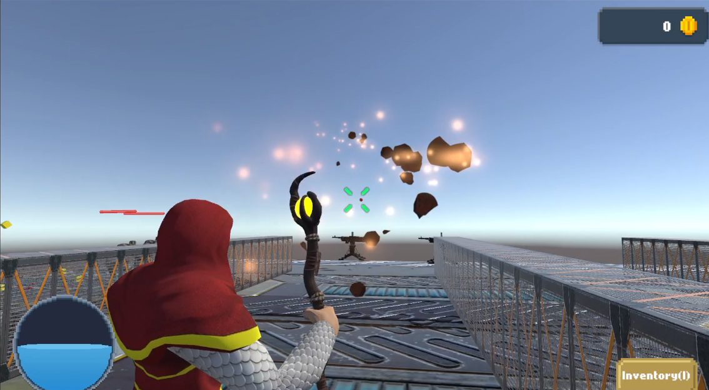
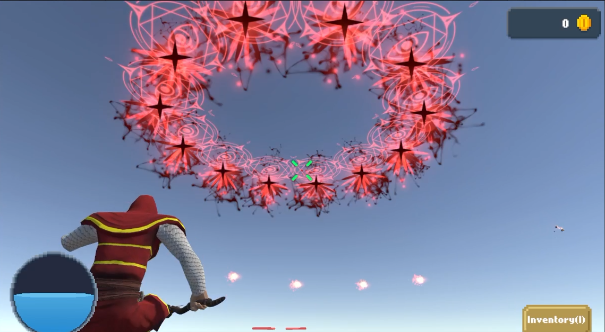
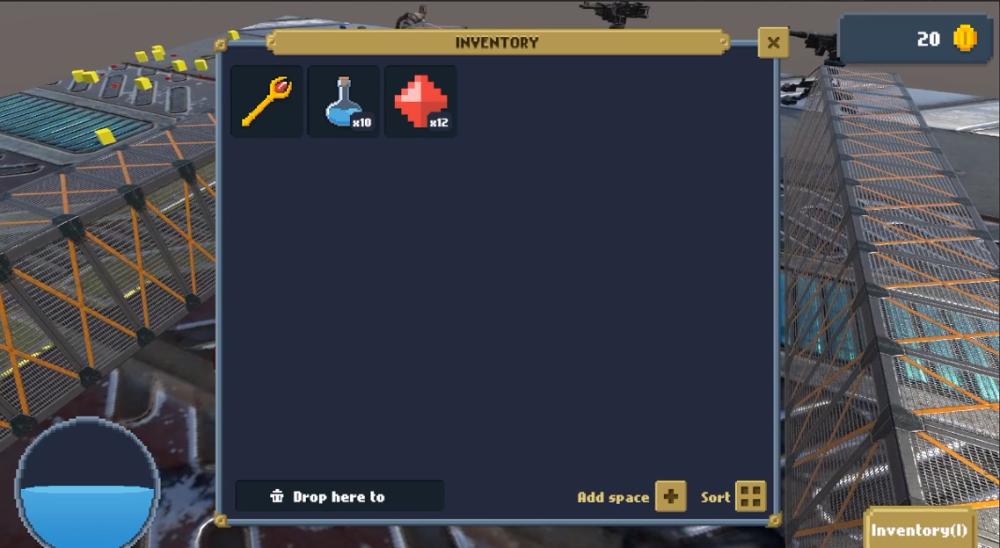
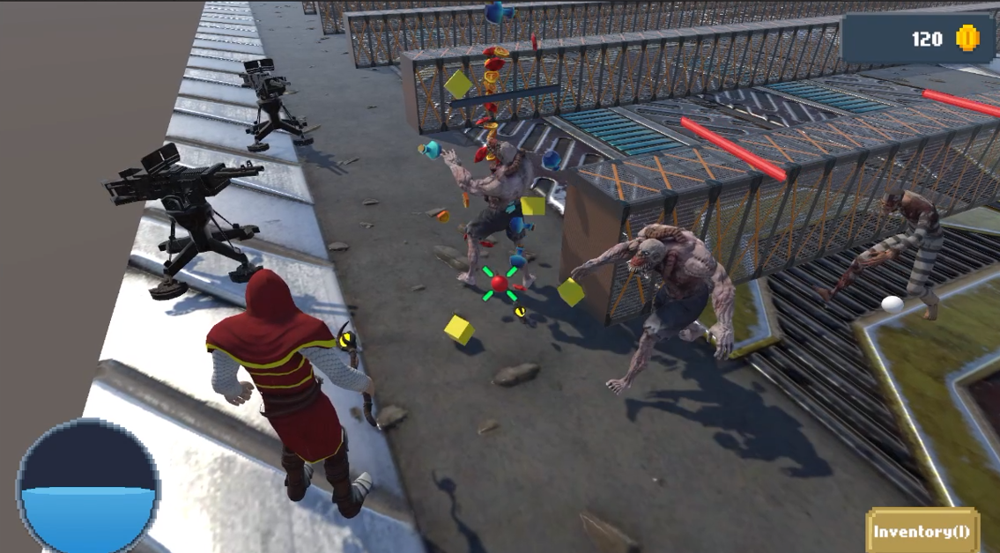

# This is Project tutorial from [SaiGame](https://www.youtube.com/watch?v=EDmoYGW8wXg&list=PL9YFzEkTXjbNa2vGgWFCBkNaNCzAFRSQ1). It name is C4 in *C4 series*. (3D game)
(Note: This series is for channel members only, which costs 30k/month.)
### 💡 Things Learned:
1. 🎬 Animation:
    1. Ik bone: Used to animate the player's arm when aiming a skill.
    2. Avatar Mask: Used to merge two animations for the Enemy:
        * Walk to target.
        * Playing a 'hurt' animation when receiving damage.
    3. Base Player Animation: Used the Third Person Controller package from the Unity Asset Store.
    4. Mixamo: Used for the enemy model and animations (e.g., Walk, Hurt, Death).
2. 🗺️ Nav Mesh:
    1. Set up waypoints for enemies to follow a path to the target.
3. 🎒 Inventory:
    1. Implemented item pickups from defeated enemies.
    2. Implemented inventory sorting and dropping.
4. 💻 Code System:
    1. Simple Object Pooling (for bullets, enemies, items).
    2. Simple Observer Pattern (for the damage system).
    3. Applied OOP, Clean Code, and Generics.
5. 🌟 Other:
    1. Used Asset Store packages (VFX, Particle Systems).
    2. Created basic UI (e.g., health bars).
### 🧾 Sumary when I compled the course
* ✅ Became more familiar with the Unity Engine.
* ⚙️ For me, the code and UI system have almost no reusability for later — because they feel more like introducition level project 😅 =))
* 👍👍👍However, the course is really good for beginners — I recommend it! 😄 =))
### Preview:
* 
* 
* 
* 
